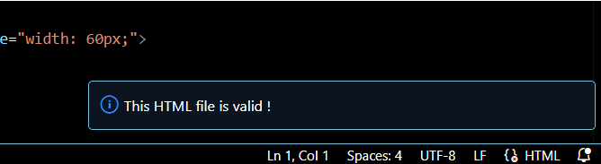
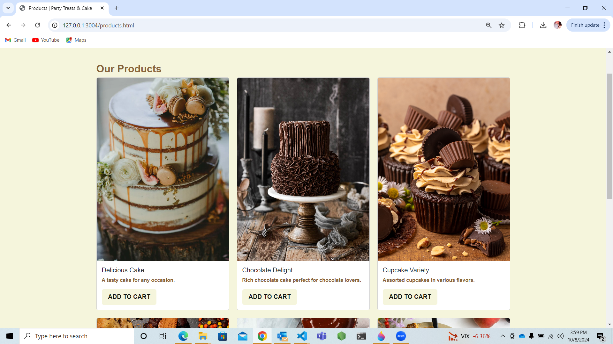

# Party Treats & Cake E-Commerce Website Capstone

This is my capstone project, an e-commerce website built using HTML, CSS, and Bootstrap. The website is designed to sell party treats, cakes, and other sweets, the website layout if very simple and user friendly, it has 6 pages to browse:

-Homepage (index1.html): A welcoming page that displays the logo, a menu in the nav bar that takes to the pages of the website, a couple of GIF cake images, a small "About Us" paragraph and the button "Shop Now" displayed in 3 spots throught the page.

-Products Page (products.html): Displays 6 available products with images, descriptions, and a "Buy Now" button for each item.

-Sign-in Page (Login.html): Displays a form for existing users to login to their accounts with a "Remember me" box.

-Registration Page (register.html): Includes a form for users to sign up, featuring required fields like username, password, and email.

- Password reset Page(password.html): a page tha has a "enter your email" box, in which the user can enter their email in case they forgot their password.

- Checkout Page (checkout.html): Displays items added to the cart in a table format with quantity and pricing and at the bottom, the chekout form for users to input their shipping and payment information.

## Logo 
[I created the logo using the free resources on Canva.com](style/logo2.png)

## Acknowledgements

 - [Bootstrap for CSS and some HTML] (https://getbootstrap.com/)
 - [ Some HTML lines from a website template] (https://htmlcodex.com/ice-cream-shop-website-template/)
 - [Awesome Readme Templates](https://awesomeopensource.com/project/elangosundar/awesome-README-templates)
 - [Awesome README](https://github.com/matiassingers/awesome-readme)
 - [How to write a Good readme](https://bulldogjob.com/news/449-how-to-write-a-good-readme-for-your-github-project)

## HTML validator check 

 
I made sure all the file passed the Validator check, Iused one screenshot to avoid repitition!

## Challenges
Styling with CSS was somewhat challenging but I leanred a lot of things.

## Screenshots 
- 
- 
- 
-  
- 
- 